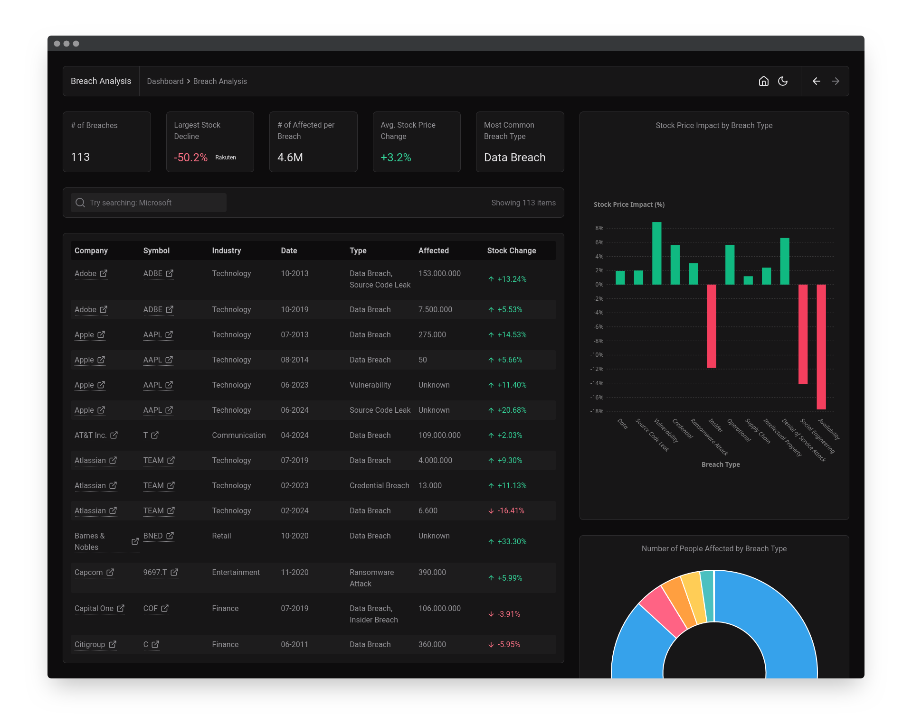

# CyberSec Visual Business Intelligence Dashboard

Maßgefertigtes CyberSecurity-Dashboard für Visual Business Intelligence (WS 24/25).



## Installation

### Docker

```bash
$ docker build -t vbi .
$ docker run --rm -it -p 80:8080 vbi
```

### Selbst kompilieren

```bash
$ pnpm install
$ pnpm build
$ pnpm preview
```

## Technologie

- [SvelteKit](https://svelte.dev)
  - [D3.js](https://d3js.org)
  - [Chart.js](https://chartjs.org)
- [Python](https://python.org)
